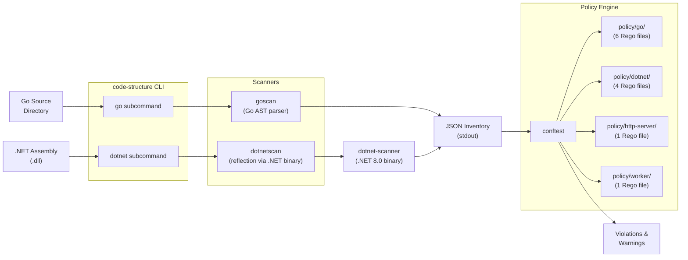

# Code Structure Analyzer — Architecture

## System Overview

The code-structure tool is a local CLI — it has no deployed infrastructure, no external service dependencies, and no persistent state. It reads source code (Go) or compiled assemblies (.NET), produces JSON, and exits.



## Go Scanner (`internal/goscan/`)

The Go scanner uses the `go/ast` and `go/parser` standard library packages to analyze Go source files without compiling them.

### Scan Flow

1. **Discovery** (`discover.go`) — determines what to scan:
   - If the target directory contains `.go` files directly, scan that single package
   - If not, scan one level of subdirectories that contain `.go` files
   - Does **not** recurse deeper than one level — this is intentional to match Go's package-per-directory model

2. **Parsing** (`parse.go`) — for each `.go` file:
   - Parses the AST using `go/parser.ParseFile` with comments enabled
   - Extracts: imports, function declarations, type declarations, variables, constants
   - Extracts `//codestructure:<tag>` comments as file-level tags (see [CLI Reference](cli-reference.md#file-tags))

3. **Output** (`scan.go`) — assembles the inventory:
   - Single package → `PackageInventory` (flat object)
   - Multiple packages → `MultiPackageInventory` (array wrapper)

### Key Design Decisions

- **AST-only, no type checker**: the scanner deliberately avoids `go/types` to stay fast and avoid needing module dependencies to be available. Trade-off: it can't resolve cross-package types.
- **Shallow scan depth**: scanning only one level of subdirectories keeps the scope predictable and maps cleanly to individual packages. Users who need deeper scans run the tool on each package directory.
- **Tags as escape hatches**: the `//codestructure:` comment system lets individual files opt out of specific policies without disabling the policy globally.

## .NET Scanner (`internal/dotnetscan/` + `tools/dotnet-scanner/`)

The .NET scanner uses a two-process architecture because Go cannot reflect on .NET assemblies directly.

### Scan Flow

1. **Binary resolution** (`exec.go`) — finds the `dotnet-scanner` binary via a 3-step lookup:
   - `CODESTRUCTURE_DOTNET_SCANNER` environment variable (explicit path)
   - Sibling binary in the same directory as the `code-structure` executable
   - `PATH` lookup
2. **Execution** — invokes `dotnet-scanner <assembly.dll>` as a subprocess; the .NET tool uses `System.Reflection` to enumerate namespaces, types, methods, properties, and fields
3. **Output** — the .NET scanner writes JSON to stdout; the Go process captures and forwards it

### .NET Scanner Tool (`tools/dotnet-scanner/`)

A standalone .NET 8.0 console application. Built separately with:

```bash
dotnet publish tools/dotnet-scanner -c Release -o ./bin/dotnet-scanner
```

## Policy Engine

Policies are written in Rego and evaluated by [Conftest](https://www.conftest.dev/). The scanner's JSON output becomes the `input` document for Rego rules.

### Severity Model

Policies use two different Rego output targets to communicate severity:

| Target | Conftest Behavior | Meaning |
|--------|------------------|---------|
| `violation_*` | Treated as **failures** (non-zero exit) | Structural problem that must be fixed |
| `warn` | Treated as **warnings** (zero exit, printed) | Suggestion worth considering; not enforced |

Each violation object includes a `rule_id`, `severity`, and `msg` for machine-readable processing.

### Policy-Scanner Contract

The policy files expect specific input shapes:

- **Go policies** expect `input.files` (single package) or `input.packages` (multi-package)
- **.NET policies** expect `input.namespaces` with nested `types`, `methods`, `properties`, `fields`
- **HTTP Server / Worker** policies expect `input.files` (single package) and check for required exported functions

See [CLI Reference](cli-reference.md) for the full JSON schemas.
